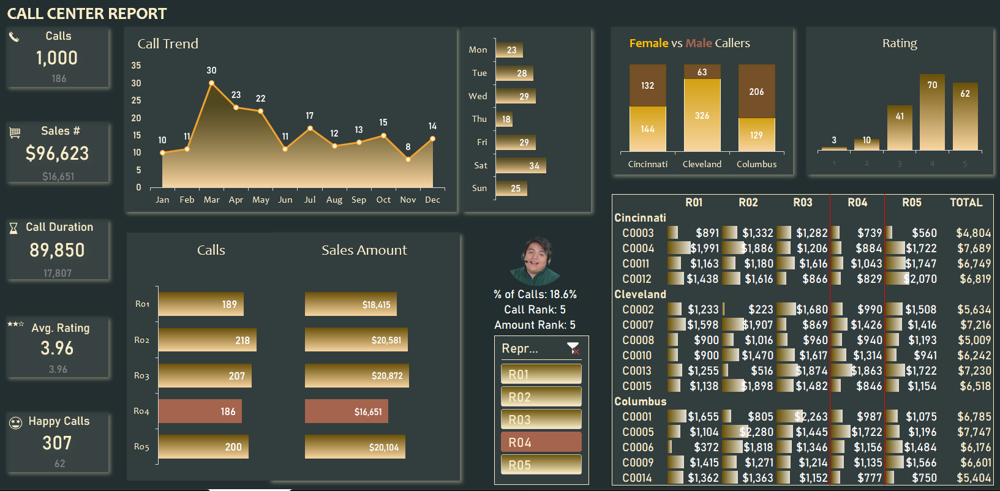

# Call-Center-performance-dashboard-Tutorial

## Overview
This tutorial teaches how to build a comprehensive, interactive call center performance dashboard in Excel that combines power pivot, slicers, interactive charts, and conditional formatting. The dashboard is fully dynamic and updates based on selected representatives.

## What the Dashboard Includes
- **Representative selection** with picture display
- **Live KPI metrics** (calls, amounts, duration, ratings, happy callers)
- **Overall vs selected representative** comparison
- **Interactive charts** that highlight selected representatives
- **Trend analysis** by date and weekday
- **Customer demographics** by gender and city
- **Rating distribution** for each representative
- **Customer revenue analysis** table with conditional highlighting

> Example outputs of the completed tracker.

### Call Center performance Dashboard



---

## DATASET AND ASSETS

### Call Center Data Structure
**Calls Table columns:**
- Call Number
- Customer ID
- Duration
- Representative
- Date
- Purchase Amount
- Satisfaction Rating
- Financial Year (calculated)
- Day of Week (calculated)
- Duration Bucketing (calculated)
- Rating Rounded (calculated)

### Customer Data Structure
**Customers Table columns:**
- Customer ID
- Gender
- Age
- City (Columbus, Cincinnati, Cleveland)

### Assets Tab
Contains stock images and icons:
- Representative profile pictures (created from stock images)
- Icons for calls, money, time, etc.
- All images formatted as circular crops

---

## SETUP STEPS

### Setting Up Color Scheme and Fonts

#### Choose Color Theme
1. Page Layout ribbon > Colors
2. Select "Slipstream" theme
3. All table colors automatically update

#### Choose Font Theme
1. Page Layout ribbon > Fonts
2. Select "Aptos Extra Bold and Aptos"
3. Alternatively: Customize Fonts
   - Heading Font: Aptos Extra Bold
   - Body Font: Aptos

**Benefits:**
- Consistent styling across entire dashboard
- No need to manually select fonts repeatedly
- Automatic application to all text elements

### Creating Dashboard Tab
1. Add new tab named "Customer Center Report"
2. Make first two columns narrow
3. Select large range (entire dashboard area)
4. Fill with dull gray background color
5. This creates the canvas for the dashboard

---

## CREATING PIVOT TABLES

### Setting Up the Data Model

#### Why Use Data Model?
- Combines multiple tables (Calls + Customers)
- Enables Power Pivot features
- Allows DAX measures
- Creates relationships between tables

#### Insert First Pivot Table
1. Select any cell in Calls table
2. Insert > PivotTable
3. **Critical:** Check "Add this data to the data model"
4. New worksheet > OK
5. Rename worksheet as "Pivots"

### Setting Up Table Relationships

#### Create Relationship
1. In Pivot Table, go to Analyze ribbon
2. Click "Relationships"
3. New Relationship
4. **Table 1:** Calls table, Column: Customer ID
5. **Table 2:** Customers table, Column: Customer ID
6. Click OK

**Result:** Both tables now connected via Customer ID

#### Verify Relationship
1. PivotTable Fields pane shows "Active" and "All" tabs
2. Click "All" to see both tables listed
3. Can now pull data from either table

---

## CALCULATING DAX MEASURES FOR KPIs

### Understanding DAX vs Regular Pivot Calculations

**Traditional Method:**
- Drag fields to Values area
- Limited formatting control
- No custom calculations

**DAX Method (Using Data Model):**
- Right-click table > Add Measure
- Write formulas using DAX language
- Format during creation
- Reusable across pivots

### Creating Call Count Measure

**DAX Formula:**
```DAX
Call Count = COUNTROWS(Calls)
```

**Setup:**
1. Right-click Calls table in Field List
2. Add Measure
3. Measure Name: "Call Count"
4. Formula: `COUNTROWS(Calls)`
5. Format: Number, Whole number, Thousand separator
6. Click OK

**What it does:** Counts total rows in Calls table (each row = one call)

### Creating Total Amount Measure

**DAX Formula:**
```DAX
Total Amount = SUM(Calls[Purchase Amount])
```

**Setup:**
1. Add Measure
2. Measure Name: "Total Amount"
3. Formula: `SUM(Calls[Purchase Amount])`
4. Format: Currency, No decimal places
5. Click OK

### Creating Total Duration Measure

**DAX Formula:**
```DAX
Total Duration = SUM(Calls[Duration])
```

**Setup:**
1. Add Measure
2. Formula: `SUM(Calls[Duration])`
3. Format: Number (or custom for hours/minutes)

### Creating Average Rating Measure

**DAX Formula:**
```DAX
Average Rating = AVERAGE(Calls[Satisfaction Rating])
```

**Setup:**
1. Add Measure
2. Formula: `AVERAGE(Calls[Satisfaction Rating])`
3. Format: Number with 1-2 decimal places

### Creating Five Star Calls Measure

**DAX Formula:**
```DAX
Five Star Calls = CALCULATE([Call Count], Calls[Rating Rounded] = 5)
```

**Breakdown:**
- `CALCULATE()` modifies calculation context
- Takes existing measure: `[Call Count]`
- Adds filter: `Calls[Rating Rounded] = 5`
- Only counts calls where rounded rating equals 5

**Setup:**
1. Add Measure
2. Measure Name: "Five Star Calls"
3. Formula: `CALCULATE([Call Count], Calls[Rating Rounded] = 5)`
4. Format: Number, Whole number, Thousand separator

**Result:** Out of 1,000 calls, 307 are five-star (happy callers)

---

## CREATING SUMMARY PIVOT TABLES

### Summary Pivot (Overall Business)

**Purpose:** Shows overall call center performance

**Setup:**
1. Use the pivot table created above
2. Add to Values area:
   - Call Count
   - Total Amount
   - Total Duration
   - Average Rating
   - Five Star Calls
3. Rename pivot: PivotTable Analyze > Name: "Summary Pivot"

**Result:** Shows aggregated metrics for entire call center

### Rep Pivot (Selected Representative)

**Purpose:** Shows metrics for currently selected representative

**Setup:**
1. Copy Summary Pivot (Ctrl+C, Ctrl+V)
2. Paste below Summary Pivot
3. Rename: "Rep Pivot"
4. Add Representative slicer:
   - Right-click on Representative field
   - Add as Slicer
5. Slicer connects ONLY to Rep Pivot (not Summary Pivot)

**Testing:**
- Select R02 → Rep Pivot updates, Summary Pivot doesn't
- This creates "Overall" vs "Selected" comparison

---

## MAKING DASHBOARD TILES

### Creating KPI Tile Shapes

#### Insert Rectangle Shape
1. Row 4 (leave rows 1-3 for headers)
2. Insert > Shapes > Rectangle
3. Hold ALT while dragging to snap to cell borders
4. Size approximately 2 rows tall, 3 columns wide

#### Format the Shape
**Fill Color:**
- Choose brick/orange color from theme

**Outline:**
- Shape Outline > No Outline

**Shadow Effect:**
1. Shape Effects > Shadow > Drop Shadow
2. Press Ctrl+1 to open Format Shape
3. Shadow settings:
   - Transparency: 50%
   - Blur: 20 points
   - Distance: 10 points

**Result:** Professional-looking tile with depth

### Linking Shape to Pivot Data

#### Important: Disable Get Pivot Data

**Problem:**
By default, Excel creates GETPIVOTDATA formulas instead of cell references

**Solution:**
1. Select any pivot table
2. PivotTable Analyze > Options
3. Uncheck "Generate GetPivotData"
4. **This is one-time setting** across all pivots

#### Link the Tile
1. Select the rectangle shape
2. Click in Formula Bar
3. Type `=` then click on pivot value cell
4. Should show: `=Pivots!A4` (NOT GETPIVOTDATA)
5. Press Enter

**Result:** Shape displays 1,000 (total calls)

#### Format the Number Display
1. Select shape
2. Center align
3. Font: Aptos Extra Bold
4. Size: Large (e.g., 36pt)
5. Color: White

### Adding Label Text Box

#### Insert Text Box
1. Insert > Text Box
2. Draw above the number
3. Type: "Calls"

#### Format Text Box
1. Shape Format > Shape Fill > No Fill
2. Shape Outline > No Outline
3. Font: Aptos Extra Bold
4. Color: Dull white/gray
5. Size: Smaller than number (e.g., 14pt)

### Adding Icon

#### Insert Icon from Assets
1. Go to Assets tab
2. Copy telephone icon (Ctrl+C)
3. Paste in Dashboard (Ctrl+V)
4. Rotate slightly for visual interest
5. Resize to fit corner of tile
6. Graphics Format > Color > Match background color

**Result:** Icon blends with tile background

### Adding Selected Representative Value

#### Create Second Text Box
1. Insert > Text Box below the main number
2. Link to Rep Pivot value:
```excel
=Pivots!B4
```
(Where B4 contains rep-specific count)

#### Format
1. Center align
2. No outline, No fill
3. Font color: Lighter shade
4. Size: Medium (e.g., 18pt)

**Result:** Shows 218 (selected rep's calls)

### Duplicating for Other KPIs

#### Select All Elements
**Trick for Easy Selection:**
1. Home > Find & Select > Select Objects
2. Cursor changes to pointer
3. Drag around entire KPI tile
4. Selects all shapes/text boxes at once
5. Press Escape to exit select mode

#### Duplicate
1. With all elements selected: Ctrl+C
2. Press Escape
3. Ctrl+V five times (for 5 remaining KPIs)

#### Update Each Tile
**Change labels:**
- Calls → Amount → Duration → Rating → Happy Callers

**Update formulas:**
- Change cell references:
  - A4 → B4 (Total Amount)
  - A4 → C4 (Total Duration)
  - A4 → D4 (Average Rating)
  - A4 → E4 (Five Star Calls)

**Change icons:**
1. Go to Assets tab
2. Copy appropriate icon
3. Right-click on current icon
4. Change Graphic > From Clipboard

**Adjust icon rotation and colors**

#### Fix Formatting
1. Select first properly formatted text box
2. Double-click Format Painter
3. Click all other text boxes
4. Press Escape

**If numbers are cropped:**
- Either widen text boxes
- Or reduce font size (e.g., to 24pt)

### Testing the KPI Tiles
1. Go to Pivots tab
2. Cut slicer (Ctrl+X)
3. Paste in Dashboard
4. Select different representatives
5. Verify all numbers update correctly
6. Test multi-select (Ctrl+click multiple reps)

---

## CREATING TREND CHARTS

### Calls Trend Line Graph (by Date)

#### Create Pivot for Date Trend
1. Go to Pivots sheet
2. Copy existing pivot connected to slicer (e.g., Rep Pivot)
3. Paste below (Ctrl+V)
4. **Important:** Copying ensures slicer connection maintained
5. Remove all existing fields

#### Configure Date Trend Pivot
**Rows:**
1. Drag "Date of Call" to Rows
2. Excel automatically groups by Month/Quarter/Year
3. Keep the date hierarchy (Year > Month > Days)

**Values:**
1. Drag "Call Count" measure to Values

**Result:** Daily call counts aggregated by month

#### Create Line Chart with Area
1. Select any cell in pivot
2. Insert > Line Chart > Line with Markers
3. Chart appears with single line

**Add Shaded Area (Trick):**
1. In pivot, add "Call Count" AGAIN to Values
2. Now have: Call Count, Call Count2
3. Chart shows two overlapping lines

**Change Second Series to Area:**
1. Right-click on chart
2. Change Series Chart Type
3. For "Call Count2": Change to Area Chart
4. Click OK

**Result:** Line chart with shaded area beneath

#### Move to Dashboard
1. Select chart: Ctrl+X
2. Go to Dashboard
3. Paste: Ctrl+V
4. Position appropriately
5. Hold ALT while resizing for alignment

#### Clean Up Chart Elements
1. Select chart
2. PivotChart Analyze > Field Buttons > Turn Off
3. This removes +/- buttons and field filters
4. Click + button next to chart
5. Uncheck Legend
6. Keep Chart Title (will format later)

#### Format the Area Fill
1. Select the area series
2. Press Ctrl+1 (Format Data Series)
3. Fill > Gradient Fill
4. Set up two-color gradient:
   - **Top color:** Darker brick/orange
   - **Bottom color:** Same brick/orange at 50% transparency
5. Direction: Vertical
6. Result: Faded look from top to bottom

#### Format the Line
1. Select the line series
2. Line Color: Brick/orange (matching theme)
3. Line Width: 2-3pt

#### Format the Markers
**Marker Options:**
1. Select line series
2. Format Data Series > Marker
3. Built-in
4. Type: Circle
5. Size: 7 points

**Marker Fill:**
- Solid Fill
- Color: White

**Marker Border:**
- Solid Line
- Color: Dark gray/black
- Width: 2 points

**Result:** White circles with dark borders stand out clearly

#### Test Interactivity
- Select different representative
- Chart updates to show only their calls
- Clear slicer → Shows all calls

### Weekday Trend Bar Graph

#### Create Weekday Pivot
1. Copy the date trend pivot
2. Paste below
3. Remove Date of Call from Rows
4. Remove all Call Count fields from Values

#### Configure Weekday Pivot
**Rows:**
1. Drag "Day of Week" to Rows
2. Shows Sunday through Saturday

**Values:**
1. Drag "Call Count" to Values

**Problem:** Days appear in alphabetical order (Friday, Monday, Saturday...)

**Fix Pivot Order:**
1. Right-click on any day
2. Sort > A to Z
3. Now shows Sunday through Saturday in order

#### Create Bar Chart
1. Select pivot cell
2. Insert > Bar Chart > 2D Clustered Bar

**Problem:** Chart shows Saturday at top, Sunday at bottom (reversed)

**Fix Chart Order:**
1. Select vertical axis (days)
2. Press Ctrl+1 (Format Axis)
3. Check "Categories in reverse order"
4. Result: Sunday at top, Saturday at bottom

#### Move to Dashboard
1. Cut chart (Ctrl+X)
2. Paste in Dashboard
3. Position next to date trend chart

#### Format the Chart
**Remove Elements:**
- Field buttons: Off
- Legend: Off
- Axis titles: Off
- Gridlines: Off

**Adjust Gap Width:**
1. Select bars
2. Press Ctrl+1
3. Gap Width: 25%
4. Makes bars thicker

**Fill Color:**
1. Select bars
2. Fill > Solid Fill
3. Color: Brick/orange

**Add Data Labels:**
1. Click + next to chart
2. Check Data Labels
3. Labels appear on bars
4. Color: White or contrasting color

#### Position and Layer
1. Resize chart to fit space
2. Hold ALT for perfect alignment
3. Format > Send to Back (if needed to layer behind other elements)

#### Add Chart Titles
Will add titles at the end of dashboard creation

**Testing:**
- Select different reps
- Both date and weekday charts update
- Shows patterns for selected rep

---

## CREATING CALLS AND AMOUNTS BY REP CHART

### The Challenge
Need to show:
- Bar chart with calls by representative
- Bar chart with amounts by representative
- Currently selected rep highlighted in different color
- Both charts side-by-side

### Creating the Reps Pivot

#### Insert New Pivot from Data Model
1. Go to Pivots sheet
2. Insert > PivotTable
3. Choose "Use this workbook's Data Model"
4. Location: Existing worksheet, select cell
5. Click OK

**Alternative Method:**
1. Go to Data tab
2. Select any cell in Calls table
3. Insert > PivotTable
4. Check "Add this data to the data model"
5. Location: Pivots sheet

#### Configure Reps Pivot
**Rows:**
1. Drag "Representative" to Rows
2. Shows R01, R02, R03, R04, R05

**Values:**
1. Drag "Call Count" to Values
2. Drag "Total Amount" to Values

**Name the Pivot:**
1. Select pivot
2. PivotTable Analyze > Name: "Reps Pivot"

**Result:** Table showing each rep's calls and amounts

**Problem:** Can't create two separate bar charts from one pivot table

### The Workaround: External Data Range

#### Create Linked Range Outside Pivot
**Purpose:** Pivot does calculation, external range creates chart

**Setup:**
1. Click in cell next to pivot
2. Type header: "For Graph"
3. Below, create structure:
```
Representative | Calls | Amount
```

**Link the Data:**
1. First cell under "Representative": `=` click first rep cell
2. Press Enter
3. Select all 5 cells (rep names, calls, amounts)

**Formula:**
```excel
=Pivot_Range_Reference
```

**For older Excel versions:**
- Can't select entire range at once
- Must link each cell individually
- Drag down and across

**Result:** Data duplicated outside pivot, updates when pivot updates

### Creating the Bar Charts

#### First Chart (Calls)
1. Select only Representative and Calls columns from linked range
2. Insert > Bar Chart > 2D Clustered Bar

**Fix Axis Order:**
1. Select vertical axis (representatives)
2. Ctrl+1 > Categories in reverse order
3. Now matches data order

#### Second Chart (Amounts)

**Method 1 - Create New:**
1. Select Representative and Amount columns
2. Insert > Bar Chart

**Method 2 - Duplicate (Faster):**
1. Select first chart
2. Ctrl+C, Ctrl+V
3. Click on bars in duplicated chart
4. Select range button appears in formula bar
5. Drag to select Amount column instead of Calls

**Fix Both Chart Axes:**
1. Select each chart's Y-axis
2. Ctrl+1 > Axis Options
3. Minimum: 0 (prevents misleading scaling)

### Format Both Charts

**Remove Elements:**
- Chart titles (for now)
- Axis titles
- Gridlines
- Legend (not needed)

**Adjust Gap Width:**
- Select bars
- Ctrl+1
- Gap Width: 25%

**Colors:**
- Calls chart: Orange/brick color
- Amounts chart: Same orange/brick color

**Add Data Labels:**
- Click + button
- Check Data Labels

**Format Amount Labels (Custom):**
1. Select data labels on Amounts chart
2. Ctrl+1 > Number
3. Category: Custom
4. Format code: `$#,##0.0,"K"`
5. Result: Shows $18.5K instead of $18,520

**Breakdown:**
- `$` = Dollar sign
- `#,##0.0` = Number with one decimal, thousand separator
- `,"K"` = Divide by 1000 and add "K"

**Position Charts:**
1. Move both to Dashboard
2. Position side-by-side
3. Remove all borders/outlines from charts

**Add Container Box:**
1. Insert rectangle behind both charts
2. Fill: White
3. Outline: Gray border
4. Send to Back
5. Creates unified appearance

### Adding Highlighting for Selected Rep

#### Create "Selected Rep" Indicator

**In Pivots sheet:**
1. Create new column: "Sel Calls" and "Sel Amount"
2. These will show values ONLY for selected rep
3. All others will be NA() or blank

#### Create Selected Rep Pivot
1. Below Reps Pivot, insert new pivot from data model
2. Configure:
   - Rows: Representative
   - Values: (none yet)
3. Name: "Selected Rep Pivot"

#### Connect to Slicer
1. Right-click on Representative slicer
2. Report Connections
3. Check "Selected Rep Pivot"

**Result:** This pivot shows only selected rep(s)

**Handle Grand Total:**
1. Design > Grand Totals > Off for Rows Only

#### Extract Selected Rep Name
1. Create cell with label: "Selected Rep"
2. Next cell: `=` point to first cell in Selected Rep Pivot
3. Shows currently selected rep name

**If multi-select:**
- Shows all selected names
- For highlighting, will use first name only

#### Create Formulas for Highlighting

**Sel Calls column:**
```excel
=IF(Representative=Selected_Rep, Calls, NA())
```

**Full formula with cell references:**
```excel
=IF(B10=$B$66, C10, NA())
```

Where:
- B10 = Representative name (changes as formula copies down)
- $B$66 = Selected Rep cell (locked)
- C10 = Calls value
- NA() = Shows nothing on chart

**Drag down for all 5 reps**

**Sel Amount column:**
```excel
=IF(Representative=Selected_Rep, Amount, NA())
```

**Result:**
- Only selected rep shows value
- Others show #N/A (won't plot on chart)

### Add Highlighting to Charts

#### Add Series to Calls Chart
1. Right-click on chart
2. Select Data
3. Add
4. Series Name: "Selected Calls"
5. Series Values: Select Sel Calls range
6. OK

**Result:** New bars appear for selected rep only

#### Overlap the Bars
**Problem:** Two bars side-by-side

**Solution:** 100% overlap
1. Select the new (blue) series
2. Ctrl+1
3. Series Options > Series Overlap: 100%

**Result:** Blue bar sits perfectly on top of orange bar

#### Change Highlight Color
1. Select overlapping series
2. Fill: Darker orange or accent color
3. Optional: Gradient fill for depth
4. Gradient: Two colors, vertical direction

**Repeat for Amounts Chart:**
1. Add "Selected Amount" series
2. Set 100% overlap
3. Apply gradient fill with brick color

#### Remove Extra Axes
- If horizontal axis shows twice, delete one
- Keep only necessary elements

### Final Chart Positioning
1. Move both charts to Dashboard
2. Position side-by-side
3. Align perfectly with container box
4. Ensure no chart background (transparent)
5. Container box provides white background

### Add Chart Titles
1. Chart Title: Click to edit
2. Calls chart: "Calls"
3. Amounts chart: "Amount"
4. Font: Aptos Extra Bold
5. Size: Appropriate to dashboard

**Testing:**
- Select R05 → R05 bars highlighted
- Select R02 → R02 bars highlighted
- Multi-select → First selected rep highlighted
- All other elements update simultaneously

---

## FORMATTING SLICERS WITH STYLES

### Problem
- Slicer default blue color doesn't match orange theme
- Unselected items too prominent

### Apply Base Style
1. Select slicer
2. Slicer tab appears
3. Choose style from gallery
4. Select orange/brick theme option

**Result:** Better color match, but can be refined

### Create Custom Slicer Style

#### Duplicate Existing Style
1. Select slicer
2. Right-click on chosen style
3. Duplicate
4. Creates copy for customization

#### Modify Style Elements

**Whole Slicer (Border):**
1. Select "Whole Slicer" element
2. Format
3. Border > Change to gray (matching other dashboard elements)

**Unselected Item with Data:**
1. Select this element
2. Format
3. Fill > Light gray or very pale orange
4. Font > Regular weight
5. **Purpose:** Tone down unselected items

**Selected Item with Data:**
1. Select this element
2. Format
3. Fill > Bright orange/brick
4. Font > Bold
5. Border > Optional darker outline

**Selected Item without Data:**
- Format similarly to selected with data

#### Apply Custom Style
1. With slicer selected
2. Click on your custom style
3. Slicer updates with new formatting

**Result:**
- Selected items: Bold, bright orange
- Unselected items: Subtle, light gray
- Border: Matches dashboard theme

---

## CALLS BY CUSTOMER DEMOGRAPHICS CHART

### Purpose
Shows gender distribution (Female/Male) across three cities (Cincinnati, Cleveland, Columbus)

### Create Demographics Pivot

#### Insert Pivot (NOT connected to Rep Slicer)
1. Pivots sheet
2. Insert > PivotTable from Data Model
3. **Don't copy existing pivot** (we don't want rep filter)
4. Click OK

**Alternative:**
If accidentally copied pivot with slicer connection:
1. Select pivot
2. Analyze > Filter Connections
3. Uncheck Representative slicer

#### Configure Pivot
**Rows:**
1. Drag "City" from Customers table
2. Drag "Gender" from Customers table
3. Creates hierarchy: City > Gender

**Values:**
1. Drag "Call Count" measure

**Power of Data Model:**
- Call Count from Calls table
- City and Gender from Customers table
- Joined via relationship on Customer ID

**Result:**
```
Cincinnati
  Female: XX
  Male: XX
Cleveland
  Female: XX
  Male: XX
Columbus
  Female: XX
  Male: XX
```

### Create 100% Stacked Bar Chart
1. Select pivot cell
2. Insert > 100% Stacked Bar Chart

**Result:** Shows proportional distribution of gender within each city

### Move and Format Chart
1. Cut chart (Ctrl+X)
2. Paste in Dashboard
3. Resize appropriately

**Remove Elements:**
- Field buttons
- Legend (will create custom)
- Vertical axis
- Gridlines

**Adjust Gap Width:**
- Select bars
- Ctrl+1
- Gap Width: 25%

### Format Bar Colors

**Female Series:**
1. Select female bars
2. Fill > Solid Fill
3. Color: Brick/orange (matching theme)

**Male Series:**
1. Select male bars
2. Fill > Solid Fill
3. Color: Green (contrasting color)

### Add Data Labels
1. Click + button
2. Check Data Labels
3. Labels show percentages

**Format Labels (Optional):**
1. Select labels
2. Shape: Rounded Rectangle
3. Fill: Solid, 50% transparent white
4. Creates subtle background for readability

**Repeat for both series**

### Create Custom Title/Legend

**Purpose:** Clearly show which color = which gender

**Method:**
1. Insert Text Box above chart
2. Type text with inline formatting:
   - "Female" in orange/brick color
   - " vs "
   - "Male" in green color
3. Format text:
   - Select "Female" → Change color to brick
   - Select "Male" → Change color to green
   - Middle text stays neutral

**Result:** Title serves as legend

**Testing:**
- Select different reps
- Chart does NOT change (by design)
- Shows overall demographic distribution

---

## RATING DISTRIBUTION HISTOGRAM

### Purpose
Shows satisfaction rating distribution for SELECTED representative

### Create Rating Pivot
1. Copy any pivot connected to Rep slicer
2. Paste in Pivots sheet
3. Ensures slicer connection maintained

#### Configure Pivot
**Remove existing fields**

**Rows:**
1. Drag "Rating Rounded" to Rows
2. Shows 0, 1, 2, 3, 4, 5 (rating scale)

**Values:**
1. Drag "Call Count"

**Name Pivot:**
- PivotTable Analyze > Name: "Rep Satisfaction"

#### Connect to Slicer
1. Right-click on Representative slicer
2. Report Connections
3. Check "Rep Satisfaction"

**Result:** Shows rating breakdown for selected rep only

### Create Column Chart
1. Select pivot cell
2. Insert > Column Chart > Clustered Column

### Move and Format Chart
1. Cut (Ctrl+X)
2. Paste in Dashboard
3. Position appropriately

**Format Bars:**
- Gap Width: 10% (tighter spacing)
- Fill Color: Orange/brick
- Add data labels

**Chart Title:**
- Edit to "Rating"
- Remove or keep as minimal label

**Testing:**
- Select R05 → Shows R05's rating distribution
- Select R02 → Shows R02's rating distribution
- Different reps have different rating patterns

### The Challenge: Missing Rating Bars

**Problem:**
- If rep has no calls with rating=1, bar doesn't show
- Chart column count changes per rep
- Makes comparison difficult

**Example:**
- R05: Shows only bars for ratings 2,3,4,5 (4 bars)
- R02: Shows bars for ratings 0,1,2,3,4,5 (6 bars)

**Solution Options:**

**Option 1: Force All Categories**
- Not easily done with pivot charts
- Would require VBA or workaround

**Option 2: Use Regular Chart (Not Pivot Chart)**
- Create formula-based range
- Force all 0-5 to always show
- More complex setup

**Option 3: Accept Dynamic Behavior**
- Document that chart adapts to data
- Include note explaining variation

**Tutorial Leaves as Homework:**
Determine best solution for your use case

---

## CUSTOMER REVENUE ANALYSIS TABLE

### Purpose
Multi-dimensional view:
- Rows: Cities and Customers within cities
- Columns: Representatives
- Values: Purchase amounts
- Highlight: Currently selected representative

### Create Customer Revenue Pivot

#### Start with Connected Pivot
1. Copy existing pivot with slicer connection
2. Paste in Pivots sheet

#### Configure Pivot
**Rows (in order):**
1. City (from Customers table)
2. Customer ID (from Customers table)

**Columns:**
1. Representative

**Values:**
1. Total Amount

**Result:** Matrix showing revenue by customer and rep

### Disconnect from Slicer

**Why:** Want to see ALL reps, not filter by selection

**Method 1:**
1. Right-click on slicer
2. Report Connections
3. Uncheck this pivot

**Method 2:**
1. Select pivot cell
2. Analyze > Filter Connections
3. Uncheck Representative slicer

**Clear Representative Filter:**
1. After disconnecting
2. Click on Representative in pivot
3. Filter > Clear Filter

**Result:** All representatives shown in columns

### Name and Format Pivot
**Name:**
- PivotTable Analyze > Name: "Rep Amounts"

**Remove Grand Total Row:**
1. Design > Grand Totals
2. On for Columns Only
3. Keeps column totals, removes row total

**Result:**
```
City         | R01  | R02  | R03  | R04  | R05  | Total
Cincinnati
  Customer 1 | $XX  | $XX  | $XX  | $XX  | $XX  | $XX
  Customer 2 | $XX  | $XX  | $XX  | $XX  | $XX  | $XX
Cleveland
  Customer 3 | $XX  | $XX  | $XX  | $XX  | $XX  | $XX
...
```

### Link to Dashboard

#### Select and Copy Pivot
**Important:** Assumes maximum 15 customers
- If more customers, adjust range
- For production, consider dynamic range

1. Select entire pivot output (A:G, rows covering all data)
2. Ctrl+C

#### Paste as Linked Values
1. Go to Dashboard
2. Select starting cell (leave rows 1-3 for headers)
3. Right-click > Paste Special > Paste Link

**Problem:** Blank cells show as 0

### Fix Zero Display

**Replace Direct Link with IF Formula:**

**Original:**
```excel
=Pivots!A10
```

**Improved:**
```excel
=IF(Pivots!A10="", "", Pivots!A10)
```

**Logic:**
- IF pivot cell is empty ("")
- THEN show empty ("")
- ELSE show pivot value

**Apply to All Cells:**
1. Create formula in first cell
2. Copy across entire range
3. Blanks now show as blanks, not zeros

### Format the Table

#### Adjust Column Widths
- Make City column wider to show full names
- Adjust representative columns for $ amounts

#### Format Headers
1. Select row with rep names
2. Manual entry or link: `=Pivots![Rep Column]`
3. Last column: Type "Total"

#### Indent Customers
1. Select Customer ID cells
2. Home > Increase Indent
3. Creates visual hierarchy under cities

#### Reduce Font Size
1. Select customer rows
2. Reduce by 1-2 points
3. De-emphasizes details, emphasizes cities

#### Format Currency
1. Select all amount cells (Ctrl+click)
2. Ctrl+1
3. Currency, $, 0 decimals

---

## CONDITIONAL FORMATTING FOR REVENUE TABLE

### Adding Data Bars

#### Apply Data Bars
1. Select all revenue cells (not headers/cities)
2. Conditional Formatting > Data Bars
3. Choose Solid Fill
4. Select color (e.g., blue or matching theme)

**Problem:** Bars overwrite numbers, hard to read

### Customize Data Bar Scale

#### Why Customize?
- Default: Bars scale from min to max in selection
- Result: Maximum value fills entire cell
- Numbers become hard to read

#### Open Data Bar Editor
1. With data bars selected
2. Conditional Formatting > Manage Rules
3. Select Data Bar rule
4. Edit Rule

#### Change Scale
**Default:**
- Minimum: Automatic
- Maximum: Automatic

**Custom:**
- Minimum: Number = 0
- Maximum: Formula = `=MAX($range)*2`

**Formula Example:**
```excel
=MAX($J$10:$N$25)*2
```

**What This Does:**
- Finds maximum value in range
- Sets bar maximum to TWICE that value
- Result: Even highest value only fills 50% of cell
- All other bars proportionally smaller
- Numbers remain easily readable

#### Change Bar Color
- Select darker color for contrast
- Ensures numbers visible against bar

**Result:**
- Visual indication of relative amounts
- Numbers still prominent and readable
- Maximum value uses ~50% of cell width

### Highlighting Selected Representative

#### Purpose
When rep selected in slicer, highlight their column in table

#### Select Table Range
1. Include headers (representative names)
2. Include all data cells
3. Don't include city names or customer IDs

#### Create Conditional Formatting Rule
1. Select range
2. Conditional Formatting > New Rule
3. Use formula to determine which cells to format

#### The Highlighting Formula
```excel
=$Q$19=Pivots!$B$66
```

**Breakdown:**
- `$Q$19` = Cell in row 19 (header row with rep names)
- `$Q` = Column locked, $ before letter
- `19` = Row locked, $ before number
- As formula copies:
  - Across: Checks R19, S19, T19, etc. (different reps)
  - Down: Always checks row 19 (header row)
- `Pivots!$B$66` = Selected rep from slicer
- Fully locked (doesn't change)

**Logic:**
- If column header (rep name) = selected rep
- THEN format entire column
- ELSE don't format

**Press F4 to cycle dollar signs correctly**

#### Apply Formatting
1. Format > Fill > Light orange/yellow
2. Border > All Borders > Darker color
3. Click OK

**Result:**
- Select R05 → R05 column highlighted
- Select R03 → R03 column highlighted
- Multi-select → First rep highlighted

### Final Table Formatting

#### Add Table Border
1. Select entire table range
2. Ctrl+1 > Border
3. Apply border around entire table
4. Creates defined boundary

#### Add Background
1. Select table range
2. Fill > White
3. Creates clean background against gray dashboard

**Result:**
- Professional-looking revenue table
- Clear visual hierarchy (cities > customers)
- Data bars show relative amounts
- Selected rep clearly highlighted
- Easy to read and interpret

#### Format City Rows
1. Select city name cells
2. Font: Bold
3. Creates clear section headers

#### Test Functionality
- Select different reps
- Highlighted column moves
- All other dashboard elements update
- Table provides detailed breakdown

---

## ADDING REPRESENTATIVE PICTURE

### Creating Stock Images (Asset Preparation)

#### Insert Stock Images
1. Insert > Pictures > Stock Images
2. Search: "Cut out people"
3. Browse professional headshots
4. Select person
5. Insert

**Result:** Full-body image appears

#### Crop to Square
1. Select image
2. Picture Format > Crop
3. Aspect Ratio > 1:1 (square)
4. Result: Square crop box appears

#### Position Crop
1. Drag crop box to show face and shoulders
2. Exclude full body
3. Create "passport photo" style
4. Zoom in if needed to fill frame with head/shoulders

#### Crop to Circle
1. With image selected
2. Picture Format > Crop
3. Crop to Shape > Oval
4. Because aspect ratio is 1:1, creates perfect circle

#### Place Image in Cell
**Excel 365 Feature:**
1. Select circular image
2. Hold ALT, drag to cell
3. Image snaps to cell borders
4. Right-click > Place in Cell
5. Image now "belongs" to cell

**Result:** Image reference is cell address (e.g., I3)

### Setting Up Rep Pictures in Assets

**For each representative:**
1. Create circular cropped image (as above)
2. Place in cell in Assets sheet
3. Create reference table:
```
Rep   | Image Cell
R01   | I3
R02   | I4
R03   | I5
R04   | I6
R05   | I7
```

### Creating Rep Summary Section

#### Location
In Pivots sheet, create section: "Rep Summary"

#### Required Information
1. Picture (image reference)
2. Percentage of calls
3. Call rank (1-5)
4. Amount rank (1-5)

### Calculate Percentage of Calls

**Formula:**
```excel
=Rep_Pivot_Calls / Summary_Pivot_Calls
```

**Example:**
```excel
=B4/A4
```

Where:
- B4 = Selected rep's calls (from Rep Pivot)
- A4 = Total calls (from Summary Pivot)

**Format:**
- Number format > Percentage
- 1 decimal place

**Result:** 18.6% (or whatever selected rep's proportion is)

### Calculate Call and Amount Ranks

#### Fetch Rep's Values

**Calls for Selected Rep:**
```excel
=XLOOKUP(Selected_Rep, Rep_Names_Range, Calls_Range)
```

**Example:**
```excel
=XLOOKUP($B$66, Reps_Pivot_Reps, Reps_Pivot_Calls)
```

**Amounts for Selected Rep:**
```excel
=XLOOKUP(Selected_Rep, Rep_Names_Range, Amounts_Range)
```

#### Calculate Ranks

**Call Rank:**
```excel
=RANK.AVG(Rep_Calls, All_Rep_Calls)
```

**Example:**
```excel
=RANK.AVG(B70, Reps_Pivot_Calls_Range)
```

**Amount Rank:**
```excel
=RANK.AVG(Rep_Amounts, All_Rep_Amounts)
```

**How RANK.AVG Works:**
- Takes value to rank (selected rep's calls)
- Compares to array (all reps' calls)
- Returns ranking (1=highest, 5=lowest in this case)

**Result:** Shows "3" if rep is 3rd in calls

### Handle Multi-Selection Problem

**Issue:** When multiple reps selected, ranks still calculate

**Solution:** Only show ranks when ONE rep selected

**Count Selected Reps:**
```excel
=COUNTA(Selected_Rep_Pivot_Range)
```

Counts how many representatives visible in Selected Rep Pivot

**Wrap Formulas:**

**Call Rank with condition:**
```excel
=IF(COUNTA(Selected_Reps)>1, "", RANK.AVG(Rep_Calls, All_Calls))
```

**Amount Rank with condition:**
```excel
=IF(COUNTA(Selected_Reps)>1, "", RANK.AVG(Rep_Amounts, All_Amounts))
```

**Logic:**
- IF more than 1 rep selected
- THEN show blank ("")
- ELSE show rank

### Create Display Text

#### Percentage of Calls Label
**Formula:**
```excel
="Percentage of calls " & TEXT(Percentage_Cell, "0%")
```

**Example:**
```excel
="Percentage of calls " & TEXT(B72, "0%")
```

**Why TEXT function?**
- Percentage_Cell contains decimal (0.186)
- TEXT converts to formatted string ("19%")
- Concatenates with label text

**Result:** "Percentage of calls 19%"

#### Call Rank Label
**Formula:**
```excel
="Call rank #" & Call_Rank_Cell
```

**With Multi-Select Protection:**
```excel
=IF(COUNTA(Selected_Reps)>1, "", "Call rank #" & Call_Rank_Cell)
```

**Result:** "Call rank #3" (or blank if multi-select)

#### Amount Rank Label
**Formula:**
```excel
="Amount rank #" & Amount_Rank_Cell
```

**With Multi-Select Protection:**
```excel
=IF(COUNTA(Selected_Reps)>1, "", "Amount rank #" & Amount_Rank_Cell)
```

### Fetch Representative Picture

**Formula:**
```excel
=XLOOKUP(Selected_Rep, Assets_Reps, Assets_Images)
```

**Example:**
```excel
=XLOOKUP($B$66, Assets!$A$2:$A$6, Assets!$B$2:$B$6)
```

Where:
- $B$66 = Selected rep
- Assets!$A$2:$A$6 = Rep names (R01, R02, etc.)
- Assets!$B$2:$B$6 = Image cells (I3, I4, etc.)

**Result:** Returns image from Assets sheet

**With Multi-Select Protection:**
```excel
=IF(COUNTA(Selected_Reps)>1, "", XLOOKUP(Selected_Rep, Assets_Reps, Assets_Images))
```

Shows blank if multiple reps selected

### Display in Dashboard

#### Create Picture Area
1. Select cells for picture (e.g., 4x4 block)
2. Merge cells
3. Creates space for circular image

#### Link Picture
```excel
=Pivots![Picture_Cell]
```

**Result:** Selected rep's picture displays

#### Add Summary Text
1. Below picture, create 3 rows
2. Each row: Merge cells across

**Row 1:**
```excel
=Pivots![Percentage_Label]
```

**Row 2:**
```excel
=Pivots![Call_Rank_Label]
```

**Row 3:**
```excel
=Pivots![Amount_Rank_Label]
```

#### Format Summary Text
1. Center align
2. Font: Regular weight, smaller size
3. Color: Light gray or subdued
4. Reduce opacity for subtle appearance

**Result:**
```
[Circular Picture of Rep]
Percentage of calls 19%
Call rank #3
Amount rank #5
```

**Testing:**
- Select R05 → Picture and stats for R05
- Select R02 → Picture and stats for R02
- Multi-select → Picture disappears, only percentage shows

---

## MAKING DASHBOARD TITLE

### Create Title Row
1. Select Row 1
2. Increase height (e.g., 40-50 points)
3. Creates space for title

### Add Title Text
1. Click in cell A1 (or merged range)
2. Type: "Call Center Report 2023"

### Format Title
**Font:**
- Font: Aptos Extra Bold (heading font)
- Size: Large (36-48pt)
- Color: Dark gray or theme color

**Alignment:**
1. Select title cells
2. Center horizontally
3. Middle align vertically

**Optional Enhancements:**
- Add company logo to left of title
- Add date range to right
- Subtle background color
- Border at bottom of row

---

## DATA REFRESH AND MAINTENANCE

### Adding New Data

#### When New Call Data Arrives
1. Go to Data tab
2. New rows automatically added to Calls table (if formatted as table)
3. Data model updates automatically

**Example:**
- January 2024 calls come in
- Add rows to Calls table
- Dates, amounts, reps, etc. populated

### Refreshing Pivots

#### Refresh All Calculations
1. Go to Data ribbon
2. Refresh All
3. All pivot tables recalculate
4. All measures update
5. Dashboard updates completely

**Keyboard Shortcut:**
- Ctrl+Alt+F5 (Refresh All)

**Individual Pivot Refresh:**
- Right-click pivot
- Refresh
- Only that pivot updates

### What Updates Automatically
- All KPI tiles
- All charts
- All conditional formatting
- Rep pictures and summaries
- Customer revenue table
- Everything linked to pivots

---

## COMPLETE FORMULA REFERENCE

### DAX Measures

**Call Count:**
```DAX
Call Count = COUNTROWS(Calls)
```

**Total Amount:**
```DAX
Total Amount = SUM(Calls[Purchase Amount])
```

**Total Duration:**
```DAX
Total Duration = SUM(Calls[Duration])
```

**Average Rating:**
```DAX
Average Rating = AVERAGE(Calls[Satisfaction Rating])
```

**Five Star Calls:**
```DAX
Five Star Calls = CALCULATE([Call Count], Calls[Rating Rounded] = 5)
```

### Dashboard Linking Formulas

**KPI Tile Number:**
```excel
=Pivots!A4
```

**With IF to handle blanks:**
```excel
=IF(Pivots!A10="", "", Pivots!A10)
```

### Rep Summary Formulas

**Percentage of Calls:**
```excel
=Rep_Pivot_Calls / Summary_Pivot_Calls
```

**Calls for Selected Rep:**
```excel
=XLOOKUP($B$66, Reps_Range, Calls_Range)
```

**Call Rank:**
```excel
=IF(COUNTA(Selected_Reps)>1, "", RANK.AVG(Rep_Calls, All_Calls))
```

**Percentage Label:**
```excel
="Percentage of calls " & TEXT(B72, "0%")
```

**Call Rank Label:**
```excel
=IF(COUNTA(Selected_Reps)>1, "", "Call rank #" & B74)
```

**Representative Picture:**
```excel
=IF(COUNTA(Selected_Reps)>1, "", XLOOKUP($B$66, Assets!$A$2:$A$6, Assets!$B$2:$B$6))
```

### Highlighting Formulas

**For Revenue Table:**
```excel
=$Q$19=Pivots!$B$66
```

**For Charts (Sel Calls):**
```excel
=IF(B10=$B$66, C10, NA())
```

### Custom Number Formats

**Thousands with K:**
```
$#,##0.0,"K"
```
Shows: $18.5K

**Week Format:**
```
"WK "#
```
Shows: WK 7

**Percentage:**
```
0%
```
Shows: 19%

---

## KEYBOARD SHORTCUTS USED

- **Ctrl+T**: Convert to table
- **Ctrl+1**: Format Cells/Shape/Chart
- **Ctrl+C**: Copy
- **Ctrl+V**: Paste
- **Ctrl+X**: Cut
- **Alt**: Hold while dragging shapes to snap to cells
- **F4**: Toggle absolute/relative references ($)
- **Ctrl+Alt+F5**: Refresh All pivots
- **Shift+Click**: Select multiple objects

---

## DESIGN BEST PRACTICES DEMONSTRATED

### Color Consistency
- Single color theme (Slipstream)
- Brick/orange for primary elements
- Green for contrasting elements
- Gray for backgrounds and borders

### Visual Hierarchy
1. Title (largest, top)
2. KPIs (prominent, eye-catching)
3. Charts (medium-large)
4. Detailed table (smallest font)

### Whitespace
- Gray background with white elements
- Spacing between sections
- Prevents crowding
- Improves readability

### Interactivity
- Single slicer controls multiple elements
- Highlighting selected representative
- Real-time updates
- Visual feedback

### Professional Touches
- Drop shadows on tiles
- Gradient fills on charts
- Circular cropped images
- Custom slicer styling
- Conditional formatting

---

## PORTFOLIO PROJECT VALUE

### Skills Demonstrated
1. **Data Modeling**: Relationships between tables
2. **DAX**: Custom measures and calculations
3. **Pivot Tables**: Multiple pivot configurations
4. **Data Visualization**: Various chart types
5. **Conditional Formatting**: Data bars, highlighting
6. **Interactivity**: Slicers, dynamic updates
7. **Design**: Professional dashboard layout
8. **Excel Advanced Features**: Power Pivot, Data Model

### Customization Challenge
**Replace visuals with your own interpretations:**
- Different chart types for trends
- Alternative KPI displays
- Additional demographic breakdowns
- New insights from same data

**Think like a data analyst:**
- What else can be shown?
- What story does the data tell?
- How can it be more useful?

---

## TROUBLESHOOTING COMMON ISSUES

### GetPivotData Problems
**Issue:** Formula shows GETPIVOTDATA instead of cell reference

**Solution:**
- PivotTable Options > Uncheck "Generate GetPivotData"

### Slicer Not Filtering Everything
**Issue:** Only some charts update when clicking slicer

**Solution:**
- Right-click slicer > Report Connections
- Check all pivots that should connect

### Picture Not Showing
**Issue:** Picture link shows #REF or blank

**Solution:**
- Ensure picture is "placed in cell" (Excel 365)
- Check XLOOKUP formula references correct cells

### Data Bars Covering Numbers
**Issue:** Can't read values behind data bars

**Solution:**
- Edit rule > Set maximum to `=MAX(range)*2`

### Chart Highlighting Not Working
**Issue:** Selected rep not highlighting in bar charts

**Solution:**
- Verify Sel Calls/Sel Amount formulas correct
- Check series overlap set to 100%
- Confirm slicer connected to Selected Rep Pivot

---

*This call center dashboard is a comprehensive portfolio project demonstrating advanced Excel skills including Power Pivot, DAX, dynamic charts, and professional dashboard design. Perfect for showcasing data analyst capabilities.*
